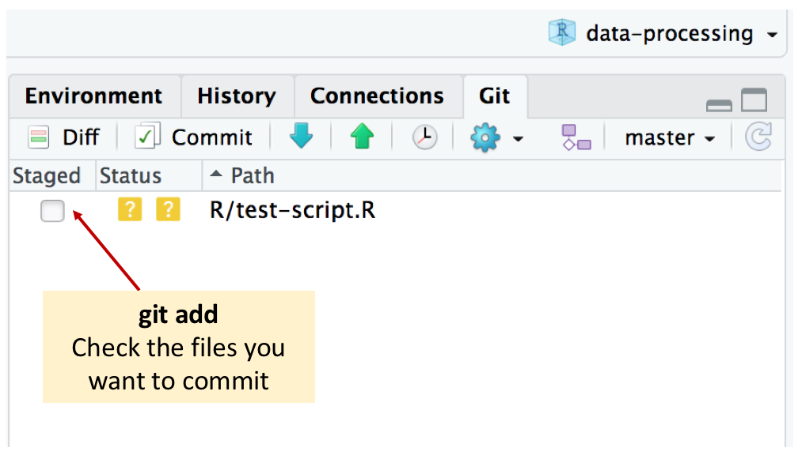
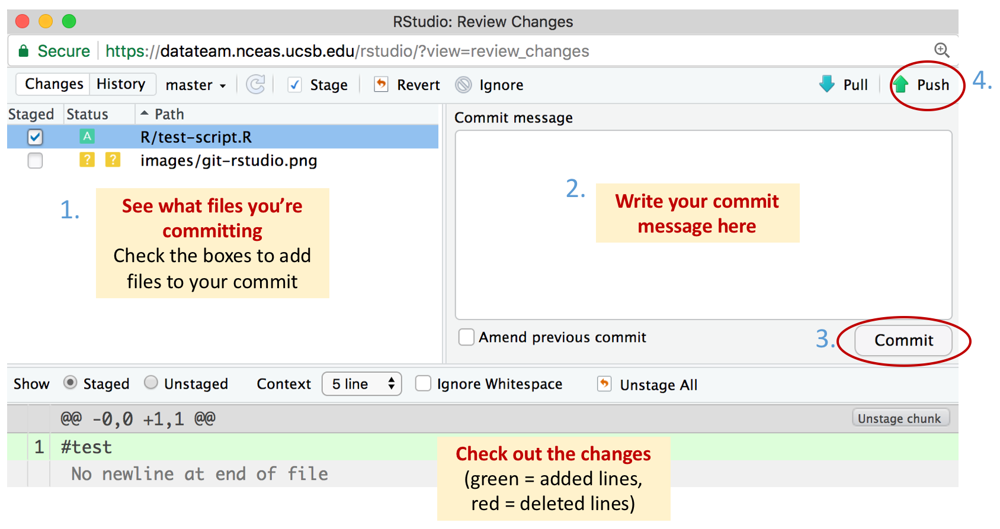
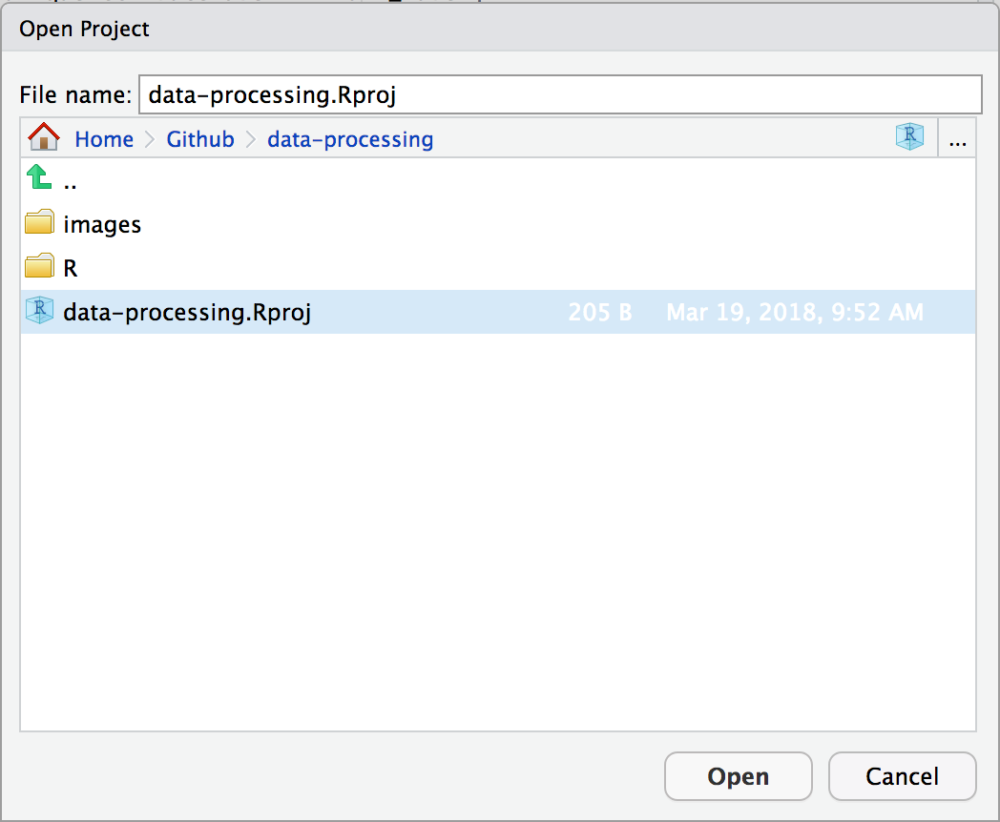

# data-processing

### *Repository dedicated to storing and improving datateam processing scripts*

- **Authors**: Dominic Mullen
- **License**: [Apache 2](http://opensource.org/licenses/Apache-2.0)
- [Package source code on Github](https://github.com/NCEAS/data-processing)
- Scripts are generally reviewed by order of submission  

## Style
We generally follow the [tidyverse style conventions](http://style.tidyverse.org/), with the following specific style preferences: 

- underscore for all variable names unless referring to an EML object (i.e. otherEntity, publicationDate, etc.)
- all functions should include argument checks in the form of `stopifnot` statements

## Contributing
### *First Contribution*
  
1. Fork the data-processing repository by clicking on the "Fork" button.  This copies the repository 
to your personal github profile.
  

  
2. Navigate to your personal github profile (https://github.com/YOURUSERNAME/data-processing) and copy the "Clone with HTTPS:" link from the "Clone or Download" button.  You must do this from your fork on your github profile!
  

3. Next, open an R session and navigate to: File >> New Project >> Version Control >> Git and paste the
repository url that you copied into the box.  

    
4. Once you've opened the project you can create a new file and save it to the R folder.  Alternatively, you can
create a new folder with your name in the R folder, and then create a new file in that subdirectory.  If this is 
a script you previously developed, I recommend just copying pasting your code into a new R file. Alternatively you 
can use the "Upload button" in the "Files" section of the Rstudio viewer to upload your R script.  
  
5.  There are two options for this next step.  You can complete it using the command line in terminal, or the Git tab in RStudio.    
    1. **Terminal:** Open the terminal tab next to your console (if it's not already open) with by pressing Shift+alt+t.  The following commands will upload your changes to your fork.  
        - `git add .`  Adds all changes to the next commit. 
        - `git commit -m "adding processing scripts"`  commits your changes.  Type an appropriate commit message in the quotation marks.
        - `git push origin master` this pushes your commit to the master branch of your fork (your github profile).

    2. **RStudio Git tab:** RStudio also has a more user-friendly interface for interacting with git. 
        - Click the checkbox in the "Staged" column of the Git tab to *add* changes to the next commit. If you want to add multiple files, highlight the files you want (click the first file, hold down *shift*, and click the last file) and then check one of the boxes. 

        - Click "Commit" to bring up the commit window. It allows you to see what changes have been made to the file(s), write a commit message (required!), and then *commit* the changes. You can also change the files you want to add here if you wish.
        - Now click *push* to sync your changes with your online GitHub repo. A window should pop up asking for your GitHub username and password. In this case, make sure you use the username/password for your PUBLIC (not Enterprise) GitHub account. 

        - *Note:* It is also extremely important to habitually *pull* from your online repository to make sure that your local repo reflects what you have online. We haven't done this here because you've just cloned your repo and your changes should be in-sync, but we'll get into this more in the next sections.
  

6. If the commit to your fork is successful, then navigate to your fork: https://github.com/YOURUSERNAME/data-processing.  
From here click on "New Pull Request" to submit your code for review.  

  
### *Making changes to your contribution*
After you've recieved comments on your pull request you'll probably need to make some changes to your code.  This is normal and you will most likely have to make some changes to your pull request based on the maintainer's review.
  
1. Open Rstudio and re-open the data-processing.Rproj.  Follow this path: File >> Open Project >> data-processing folder >> data-processing.Rproj.   

  
2. Make changes to your files and follow step 5 from [First Contribution](#first-contribution) to commit your changes.  It is generally a good idea to make multiple commits rather than one large commit.  For instance you could make one commit called "fixed typos and added comments", and commit called "fixed for loop".  Try to keep your changes in each commit related to the commit message, however, it's not necessary to make one commit for every small change you make.  Use your best judgement and look at other peoples' commits, you'll get the feel of what makes a good commit.
  
3. If you have an open pull request (you should at this point), github will recognize this and add your most recent commits to the bottom of your pull request.  Your reviewer will usually get an email notifying them that you made changes, however, it's a good idea to tag them (ex. @dmullen17) in the comments of your pull request and let them know you made updates. 
  
### *Subsequent Contributions*
If you've contributed to a repository in the past and need to do so again, it's likely that the contents changed since 
your last contribution.  Before you can submit another pull request we need to Pull any changes to your local directory.  
  
1. We can Pull any changes from upstream master (github.com/NCEAS/data-processing) using Terminal - unfortunately the Git tab in Rstudio can't do this.
    - Open Rstudio and re-open the data-processing.Rproj.  Follow this path: File >> Open Project >> data-processing folder >> data-processing.Rproj.  
    - Open the terminal tab next to your console (if it's not already open) with by pressing Shift+alt+t.  The following commands will upload your changes to your fork.
    - `git remote add upstream https://github.com/NCEAS/data-processing.git` - adds the upstream repository (you only have to do this once)
    - `git pull upstream master` - pulls any changes from the data-processing branch
  
2. Follow steps 4-6 from [First Contribution](#first-contribution)
        

## Acknowledgements
Work on this package was supported by:

- The Arctic Data Center: NSF-PLR grant #1546024 to M. B. Jones, S. Baker-Yeboah, J. Dozier, M. Schildhauer, and A. Budden

Additional support was provided by the National Center for Ecological Analysis and Synthesis, a Center funded by the University of California, Santa Barbara, and the State of California.

