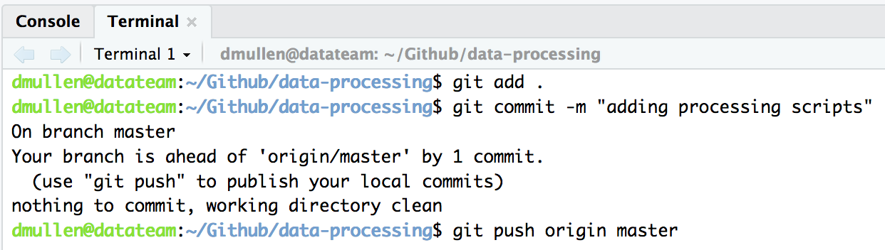
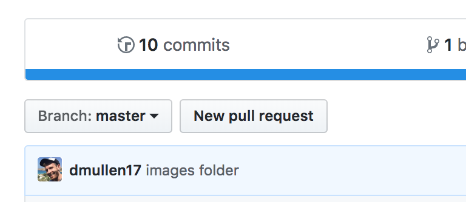

#data-processing
### *Repository dedicated to storing and improving datateam processing scripts*

- **Authors**: Dominic Mullen
- **License**: [Apache 2](http://opensource.org/licenses/Apache-2.0)
- [Package source code on Github](https://github.com/NCEAS/data-processing)

## Style
We generally follow the [tidyverse style conventions](http://style.tidyverse.org/), with the following specific style preferences: 

- underscore for all variable names unless referring to an EML object (i.e. otherEntity, publicationDate, etc.)
- all functions should include argument checks in the form of `stopifnot` statements

## Contributing
### *First Contribution*
  
- Fork the data-processing repository by clicking on the "Fork" button.  This copies the repository 
to your personal github profile.
  

  
- Navigate to your personal github profile and copy the "download with HTTPS:"" link from the "Clone or
Download" button.  You must do this from your fork on your github profile! 
  

- Next, open an R session and navigate to: File >> New Project >> Version Control >> Git and paste the
repository url that you copied into the box.  
  

  
- Once you've opened the project you can create a new file and save it to the R folder.  Alternatively, you can
create a new folder with your name in the R folder, and then create a new file in that subdirectory.  If this is 
a script you previously developed, I recommend just copying pasting your code into a new R file. Alternatively you 
can use the "Upload button" in the "Files" section of the Rstudio viewer to upload your R script.  
  
- When you are ready to commit your files(s) you can do so using the Git tab or terminal in Rstudio.  These instructions use terminal:  open terminal (if it's not already open) with by pressing Shift+alt+t.  The following commands will upload 
your changes to your fork.  
    - *git add .*  Adds all changes to the next commit 
    - *git commit -m "adding processing scripts"*  commits your changes.  Type and appropriate commit message in the parentheses
    - *git push origin master* this pushes your commit to the master branch of your fork (your github profile)
  

  
- If the commit to your fork is successful, then navigate to your fork: https://github.com/yourname/data-processing.  
From here click on "New Pull Request" to submit your code for review.  
  

## Acknowledgements
Work on this package was supported by:

- The Arctic Data Center: NSF-PLR grant #1546024 to M. B. Jones, S. Baker-Yeboah, J. Dozier, M. Schildhauer, and A. Budden

Additional support was provided by the National Center for Ecological Analysis and Synthesis, a Center funded by the University of California, Santa Barbara, and the State of California.

